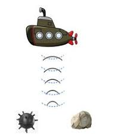

# Rock vs Mine Prediction Using SONAR Data
 This project uses machine learning techniques to predict whether an object is a rock (R) or a mine (M) based on SONAR data. It employs a logistic regression model to achieve this prediction task. 
 
 
   
                       

# Table of Contents
* Introduction
* Data
* Usage
* Results
* Installation
* workflow
# Introduction
This project focuses on using SONAR data to classify objects as rocks or mines. It demonstrates how to preprocess data, train a logistic regression model, and make predictions. The project provides insights into data analysis, model evaluation, and prediction.

# Data
The SONAR data used in this project consists of multiple features that characterize each object. These features are numerical values obtained from SONAR readings. The dataset contains a total of 208 instances.

# Usage
- Clone the repository: git clone https://github.com/yyigitturan/rock-vs-mine-prediction.git
- Navigate to the project directory: cd your-repo
- Install Dependencies:
- * pip install numpy
  * pip install pandas
  * pip install scikit-learn
- Interpret Results: After exploring the project files and code, you can interpret the results described in the "Results" section. The accuracy values provide insights into the model's performance on the provided data.

- Make Predictions (Optional): If you'd like, you can modify the input_data values in relevant code sections to make predictions for custom instances. This can help you understand how the model classifies different inputs.

- Explore the Code: Feel free to explore the project code and adapt it to your needs. The comments in the code provide explanations for each step, aiding in understanding and customization.

- Contribute (Optional)
# Results
The logistic regression model achieved an accuracy of approximately 83.4% on the training data and 76.2% on the test data. The model's predictions can be used to classify objects as rocks or mines based on SONAR data.

# Workflow

